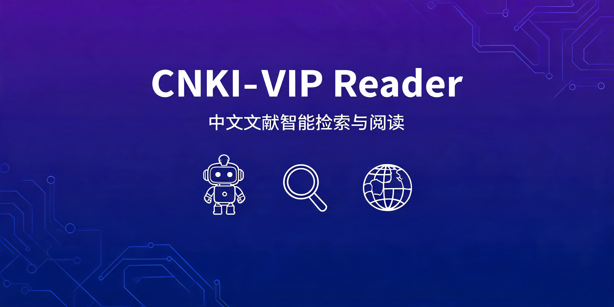

<div align="center">

[🇬🇧 English](README.md) | [🇨🇳 简体中文](README.zh-CN.md) | [🇯🇵 日本語](README.ja.md) | [🇰🇷 한국어](README.ko.md)

<br>



<br>

[](https://github.com/lechan775/cnki-vip-reader)
[](LICENSE)
[](https://www.python.org/)
[](https://github.com/lechan775/cnki-vip-reader)

</div>

<br>

# CNKI-VIP Reader

**Chinese Academic Literature Auto-Search & Reader Skill for AI Agents**

`cnki-vip-reader` empowers any AI agent to **automatically log in** to Chinese literature relay platforms, **batch search** CNKI (知网) and VIP (维普), **download full-text PDFs**, and **read them structurally**. For CNKI's proprietary PDF font encoding corruption, a built-in **multimodal visual fallback** mechanism delegates screenshot recognition to a vision-capable sub-agent, completely bypassing traditional OCR limitations.

### 🎯 Runs on Any Agent Platform

This Skill is written as a platform-agnostic workflow specification. It works wherever your agent has access to a **browser** tool (Playwright/Puppeteer) and a **bash/shell** tool:

| Platform | Status |
|----------|--------|
| **OpenHanako** | ✅ Full support — `browser` + `bash` + `subagent` |
| **Claude Code** | ✅ `bash` tool + custom Playwright MCP |
| **Codex / Hana** | ✅ `browser` + `bash` + `subagent` |
| **Custom MCP Agent** | ✅ Any agent with browser automation capability |
| **LangChain / CrewAI** | ✅ Adapt the SKILL.md to your agent's tool definitions |

> **The core workflow lives in `SKILL.md` — a human-and-machine-readable instruction file.** You adapt the tool invocations (`browser start`, `bash`, `web_search`) to whatever your agent platform calls them.

## 📄 Documentation

<details open>
<summary>Quick Start</summary>

### Install Dependencies

```bash
pip install playwright
playwright install chromium
```

### Configure

```bash
cp config.example.json config.json
# Edit config.json with your relay platform credentials
```

Or via environment variables:

```bash
export RELAY_USERNAME="your_account"
export RELAY_PASSWORD="your_password"
```

### Give the Skill to Your Agent

**OpenHanako** — copy to skills directory:
```bash
cp -r cnki-vip-reader/ ~/.hanako/skills/
```

**Claude Code** — add to CLAUDE.md or as a project skill:
```bash
# Reference SKILL.md as a custom instruction file
claude --custom-instructions ./SKILL.md
```

**Custom Agent** — feed SKILL.md into your agent's system prompt or tool context.

### Usage

Talk to your agent naturally:

```
"Search CNKI for Transformer attention mechanisms"
"Search VIP for lightweight face recognition"
"Download paper #1, #3, and #5"
```

The agent reads SKILL.md and executes the workflow automatically.

</details>

## ✨ Features

| Feature | Description |
|---------|-------------|
| 🔍 **Dual-Database Search** | Simultaneously search CNKI & VIP, output structured bibliographies |
| 📥 **No-Popup Download** | Playwright script with cookie injection, bypasses download confirmations |
| 📖 **Full-Text Reading** | Structured reading with side-by-side translation support |
| 🖼️ **Multimodal Fallback** | Screenshots → vision sub-agent recognition when CNKI fonts corrupt text extraction |
| 🔐 **Cookie Reuse** | Log in once, skip CAPTCHAs on subsequent operations |
| ⚡ **Relay Mode** | Works through a third-party relay, no institutional VPN required |
| 🌐 **Platform Agnostic** | Runs on OpenHanako, Claude, Codex, or any agent with browser + shell tools |

## 🏗️ Architecture

```
┌──────────────────┐     ┌──────────────┐     ┌──────────────┐
│  Any AI Agent    │────▶│  cnki-vip-   │────▶│  Literature   │
│  (OpenHanako/    │◀────│  reader      │◀────│  Relay (BYO)  │
│   Claude/Codex)  │     └──────┬───────┘     └──────────────┘
└──────────────────┘            │
                   ┌────────────▼────────────┐
                   │  Playwright Headless     │
                   │  Browser (download PDF)  │
                   └────────────┬────────────┘
                                │
              ┌─────────────────┼─────────────────┐
              ▼                 ▼                 ▼
         ┌────────┐      ┌──────────┐      ┌──────────┐
         │CNKI CAJ│      │ VIP PDF  │      │Screenshot│
         │  Download│     │ Download │      │ Fallback │
         └────┬───┘      └────┬─────┘      └────┬─────┘
              │                │                  │
              ▼                ▼                  ▼
         ┌──────────────────────────────────────────┐
         │  Structured Full-Text Reading & Analysis  │
         └──────────────────────────────────────────┘
```

## 🚀 Workflow

| Phase | Action |
|-------|--------|
| **1. Login** | Agent auto-fills credentials → OCR CAPTCHA → cookie persistence |
| **2A. CNKI Search** | Navigate to CNKI proxy → keyword search → bibliography extraction → download |
| **2B. VIP Search** (recommended) | Navigate to VIP → CARSI auth → search → PDF download |
| **3. Reading** | PDF extracted → structured full-text interpretation |
| **4. Fallback** | CNKI font corruption → screenshot per page → vision sub-agent OCR → merge to `.md` |

## 📊 Supported Platforms & Methods

| Platform | Search | Bibliography | PDF | CAJ | Corruption Fix |
|----------|:------:|:------------:|:---:|:---:|----------------|
| **VIP (维普)** | ✅ | ✅ | ✅ Playwright | N/A | N/A (standard PDF) |
| **CNKI (知网)** | ✅ | ✅ | ⚠️ corrupted | ✅ | Phase 4: screenshot + vision |

## ⚠️ Prerequisites

> **This repository does NOT include the relay platform itself.** You must deploy or obtain a literature relay that supports:
> - CNKI reverse-proxy to search interface
> - VIP CARSI institutional authentication
> - User login & cookie management

After deployment, replace `YOUR_RELAY_HOST`, `YOUR_CNKI_PROXY` and other placeholders in `SKILL.md` with your actual addresses.

## 📦 File Structure

```
cnki-vip-reader/
├── README.md                     ← This file (English)
├── README.zh-CN.md               ← 简体中文
├── README.ja.md                  ← 日本語
├── README.ko.md                  ← 한국어
├── SKILL.md                      ← Core workflow specification
├── LICENSE                       ← MIT License
├── assets/
│   └── social-preview.png        ← Repository cover image
├── .gitignore
├── config.example.json           ← Credentials template
└── scripts/
    └── download_vip_pdf.py       ← No-popup PDF/CAJ download script
```

## 🤝 Contributing

Issues and PRs welcome.

- Report bugs → [GitHub Issues](https://github.com/lechan775/cnki-vip-reader/issues)
- Contribute code → Fork → Feature Branch → PR
- Share your relay platform adapters
- Help translate README to more languages

## 📬 Contact

If you encounter configuration issues, feel free to reach out via QQ:

- **QQ**: 3297767619
- **Nickname**: unique&williams

## 📄 License

MIT © 2025 Guowei Jiang ([@lechan775](https://github.com/lechan775))
